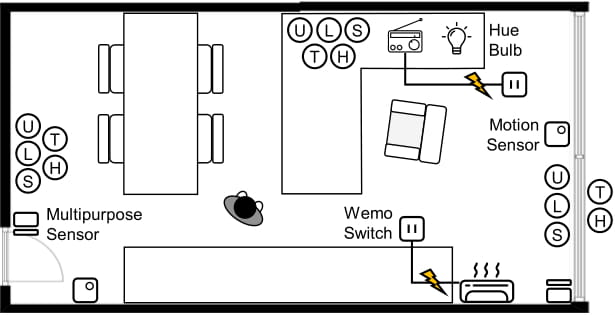

# Smart Office Dataset

## Overview

This smart office dataset includes sensor data acquired from IoT devices during 144 hours on our smart office testbed. During the 144 hours, one agent (irregularly) conducts a set of prescribed actions such as open the window. The following figure shows the floor plan of our smart office testbed.

In the testbed, we use the following 19 IoT devices:
1. 2 SmartSense Motion Sensors
2. 2 SmartSense Multipurpose Sensors
3. 3 Temperature-Humidify Sensors
4. 3 Ultrasonic Sensors
5. 3 Light Sensors
6. 3 Sound Sensors
7. 1 Philips Hue
8. 2 Belkin Wemo Switches

The dataset contains the information about which device each data item belongs to.
  
Along with the sensor data, the dataset also includes randomly generated rules that use the data items. 

## Requirement

- Matlab R2018a or higher: the dataset employs Matlab classes to represent data items, events, and rules

## Class Definition
* [`DataItem`](classes/DataItem.m)
  - `Device`   : Device that owns data item
  - `Location` : Location of parent device
  - `Type`     : Type of data item
  - `Freshenss`: Freshness interval of data item
  - `Latency`  : Retrieval latency of data item
  - `Range`    : Valid value range of data item
 
* [`Event`](classes/Event.m)
  - `DataItem` : Data item that triggers event
  - `Value`    : Value of data item that triggers event
 
* [`Rule`](classes/Rule.m)
  - `Event`    : Index of event that triggers rule
  - `Condition`: Condition tree of rule
  - `Deadline` : Relative deadline of rule
 
* [`ConditionTree`](classes/ConditionTree.m)
  - Abstract class that represents a condition tree
  - Note that `InternalNode` and `LeafNode` inherit `ConditionTree` 

* [`InternalNode`](classes/InternalNode.m)
  - `LeftTree` : Left child tree of internal node
  - `BinOp`    : Binary operator that relates LeftTree and RightTree ('&&' or '||')
  - `RightTree`: Right child tree of internal node
 
* [`LeafNode`](classes/LeafNode.m)
  - `DataItem` : Index of target data item
  - `CompOp`   : Comparative operator
  - `Value`    : Data item value to compare
 
## Dataset Description

### Data Items
* [`ItemList.mat`](dataset/ItemList.mat): List of 26 data items in the testbed
* [`ItemValue.mat`](dataset/ItemValue.mat): Acquired values of the data items

### Events
* [`EventList.mat`](dataset/EventList.mat): List of 10 events

### Rules
* [`RuleTable_Large.mat`](dataset/RuleTable_Large.mat): List of 200 rules using the entire set of the data items
* [`RuleTable_Small.mat`](dataset/RuleTable_Small.mat): List of 200 rules using the partial set of the data items

## Reference

Sharing-aware Data Acquisition Scheduling for Multiple Rules in the IoT  
Seonyeong Heo, Seungbin Song, Bongjun Kim, and Hanjun Kim  
To Appear: Proceedings of the IEEE Real-Time And Embedded Technology And Applications Symposium (RTAS), April 2020.  
